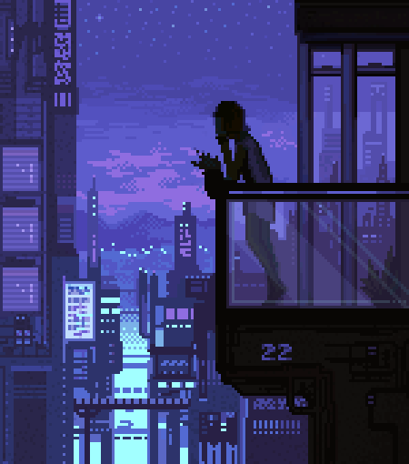
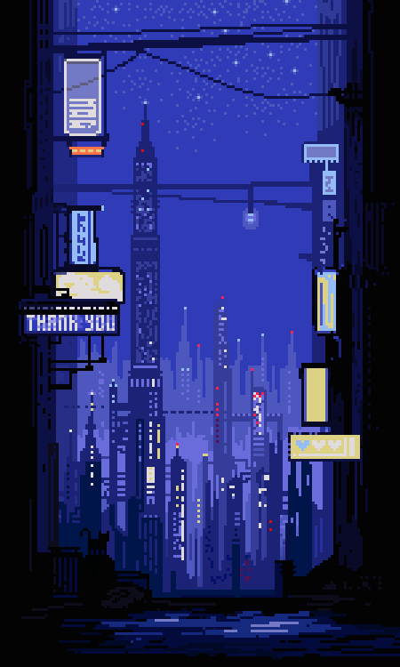

---

  
    
  
  
    
  
  
    
  

---

<h3>💻 Frontend Developer | JavaScript | React | TypeScript</h3>  

<h3>🌱 Currently learning: Next.js & Node.js </h3>
<h3>📫 Reach me: <a href="https://t.me/qqarkis">Telegram</a> | <a href="mailto:vladislavsafarov04@mail.ru">Email</a></h3>

---

### 🧰 Tech Stack

  

---

### Activiti

### 🥋 Codewars

